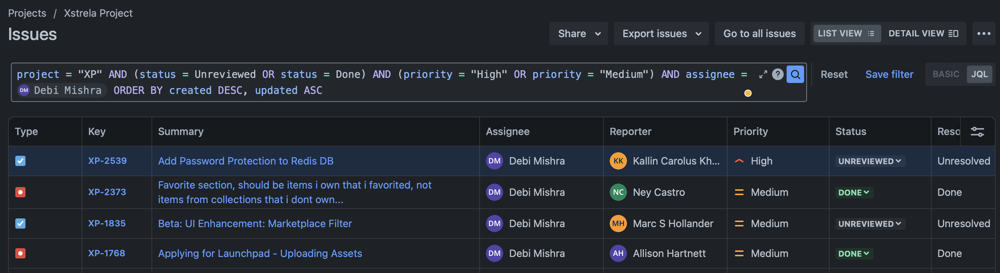

# JQL: Jira Query Language

This is a setup of a Jira Advance Query Language



This contains all the operators like:

- AND
- OR
- NOT
- ORDER BY
- IN
- IS
- IS NOT
- CONTAINS
- "!=", ">=", "<=", ">", "<", "="

### Example Queries and Results

#### Example 1

```jql
status = Unreviewed AND (priority = "High" OR priority = "Medium") AND assignee IS NOT NULL ORDER BY created_at DESC, updated_at ASC
```

```SQL
[+] JQL: status = Unreviewed AND (priority = "High" OR priority = "Medium") AND assignee IS NOT NULL ORDER BY created_at DESC, updated_at ASC

[+] QUERY:
 SELECT "issue"."id" AS "issue_id", "issue"."title" AS "issue_title", "issue"."description" AS "issue_description", "issue"."status" AS "issue_status", "issue"."assignee" AS "issue_assignee", "issue"."priority" AS "issue_priority", "issue"."resolved" AS "issue_resolved", "issue"."created_at" AS "issue_created_at", "issue"."updated_at" AS "issue_updated_at" FROM "issue" "issue" WHERE "issue"."status" = :value0 AND ("issue"."priority" = :value0 OR "issue"."priority" = :value2) AND "issue"."assignee" IS NOT NULL ORDER BY "issue"."created_at" DESC, "issue"."updated_at" ASC
```

#### Example 2

```jql
status = Unreviewed AND (priority = "High" OR priority = "Medium") AND assignee = 61e6cafefd5a690068bfb7b0 ORDER BY created_at DESC, updated_at ASC
```

```SQL
[+] JQL: status = Unreviewed AND (priority = "High" OR priority = "Medium") AND assignee = 61e6cafefd5a690068bfb7b0 ORDER BY created_at DESC, updated_at ASC

[+] QUERY:
 SELECT "issue"."id" AS "issue_id", "issue"."title" AS "issue_title", "issue"."description" AS "issue_description", "issue"."status" AS "issue_status", "issue"."assignee" AS "issue_assignee", "issue"."priority" AS "issue_priority", "issue"."resolved" AS "issue_resolved", "issue"."created_at" AS "issue_created_at", "issue"."updated_at" AS "issue_updated_at" FROM "issue" "issue" WHERE "issue"."status" = :value0 AND ("issue"."priority" = :value0 OR "issue"."priority" = :value2) AND "issue"."assignee" = :value4 ORDER BY "issue"."created_at" DESC, "issue"."updated_at" ASC
```

#### Example 3

```jql
priority = "High" AND status = "DONE" ORDER BY id DESC
```

```SQL
[+] JQL: priority = "High" AND status = "DONE" ORDER BY id DESC

[+] QUERY:
 SELECT "issue"."id" AS "issue_id", "issue"."title" AS "issue_title", "issue"."description" AS "issue_description", "issue"."status" AS "issue_status", "issue"."assignee" AS "issue_assignee", "issue"."priority" AS "issue_priority", "issue"."resolved" AS "issue_resolved", "issue"."created_at" AS "issue_created_at", "issue"."updated_at" AS "issue_updated_at" FROM "issue" "issue" WHERE "issue"."priority" = :value0 AND "issue"."status" = :value2 ORDER BY "issue"."id" DESC
```

#### Example 4

```jql
(status = "DONE" AND assignee = "DEBI") OR (priority = "High") ORDER BY updated_at ASC
```

```SQL
[+] JQL: (status = "DONE" AND assignee = "DEBI") OR (priority = "High") ORDER BY updated_at ASC

[+] QUERY:
 SELECT "issue"."id" AS "issue_id", "issue"."title" AS "issue_title", "issue"."description" AS "issue_description", "issue"."status" AS "issue_status", "issue"."assignee" AS "issue_assignee", "issue"."priority" AS "issue_priority", "issue"."resolved" AS "issue_resolved", "issue"."created_at" AS "issue_created_at", "issue"."updated_at" AS "issue_updated_at" FROM "issue" "issue" WHERE ("issue"."status" = :value0 AND "issue"."assignee" = :value2) OR ("issue"."priority" = :value0) ORDER BY "issue"."updated_at" ASC
```

#### Example 5

```jql
(status = Unreviewed OR status = Done) AND (priority = "High" OR priority = "Medium") AND assignee = 61e6cafefd5a690068bfb7b0 ORDER BY created_at DESC, updated_at ASC
```

```SQL
[+] JQL: (status = Unreviewed OR status = Done) AND (priority = "High" OR priority = "Medium") AND assignee = 61e6cafefd5a690068bfb7b0 ORDER BY created_at DESC, updated_at ASC

[+] QUERY:
 SELECT "issue"."id" AS "issue_id", "issue"."title" AS "issue_title", "issue"."description" AS "issue_description", "issue"."status" AS "issue_status", "issue"."assignee" AS "issue_assignee", "issue"."priority" AS "issue_priority", "issue"."resolved" AS "issue_resolved", "issue"."created_at" AS "issue_created_at", "issue"."updated_at" AS "issue_updated_at" FROM "issue" "issue" WHERE ("issue"."status" = :value0 OR "issue"."status" = :value2) AND ("issue"."priority" = :value0 OR "issue"."priority" = :value2) AND "issue"."assignee" = :value4 ORDER BY "issue"."created_at" DESC, "issue"."updated_at" ASC
```

#### Example 6

```jql
status IN (Unreviewed, "In Development") AND assignee IS NOT NULL AND (priority = "High" OR priority = "Highest") AND label IN ("backend", "frontend", "urgent")
```

```SQL
[+] JQL: status IN (Unreviewed, "In Development") AND assignee IS NOT NULL AND (priority = "High" OR priority = "Highest") AND label IN ("backend", "frontend", "urgent")

[+] QUERY:
 [
  'SELECT "issue"."id" AS "issue_id", "issue"."title" AS "issue_title", "issue"."description" AS "issue_description", "issue"."status" AS "issue_status", "issue"."assignee" AS "issue_assignee", "issue"."priority" AS "issue_priority", "issue"."label" AS "issue_label", "issue"."resolved" AS "issue_resolved", "issue"."created_at" AS "issue_created_at", "issue"."updated_at" AS "issue_updated_at" FROM "issue" "issue" WHERE "issue"."status" IN ($1, $2) AND "issue"."assignee" IS NOT NULL AND ("issue"."priority" = $3 OR "issue"."priority" = $4) AND "issue"."label" IN ($5, $6, $7)',
  [
    'Unreviewed',
    'In Development',
    'High',
    'Highest',
    'backend',
    'frontend',
    'urgent'
  ]
]
```

### Tech Stack Used

1. [express js](https://expressjs.com/)
2. [TypeORM](https://typeorm.io/)
3. [PostgreSQL](https://www.postgresql.org/)
4. [TypeScript](https://www.typescriptlang.org/)

### Steps to run this project:

1. Run `npm i` command
2. Add values in `.env.example` file and rename it to `.env`
3. Run `npm start` command

Made with ❤️ by [Debi Prasad Mishra](https://debiprasadmishra.net)
